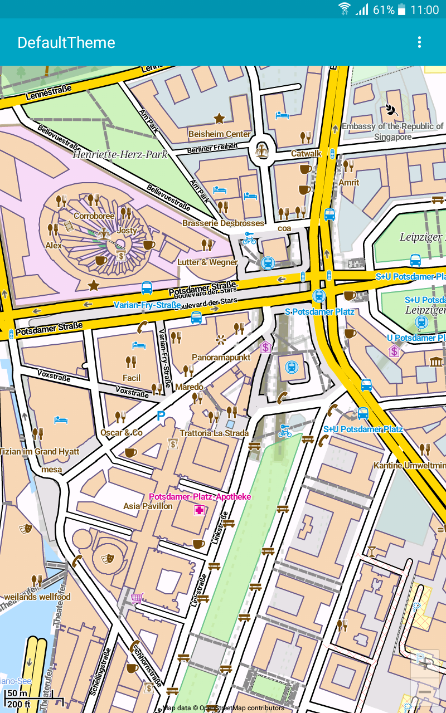
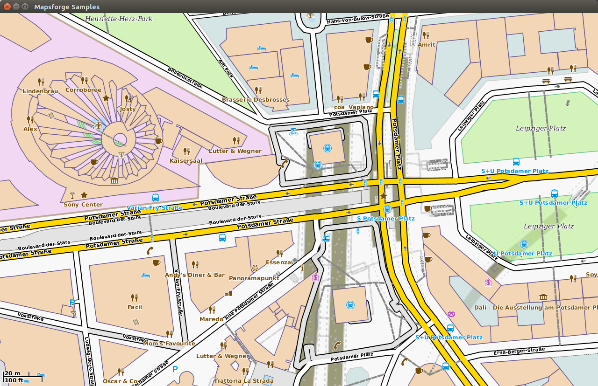

# Mapsforge

See the **[integration guide](docs/Integration.md)** and [changelog](docs/Changelog.md). And read through [how to contribute](docs/CONTRIBUTING.md) guidelines.

If you have any questions or problems, don't hesitate to ask the Discussions for help.

- Mapsforge project uses a [compact file format](docs/Specification-Binary-Map-File.md) for fast ad-hoc rendering of OpenStreetMap data.
- We provide tools to [compile your own maps](docs/Getting-Started-Map-Writer.md) with detailed [instructions](docs/MapCreation.md) and also [precompiled maps](https://download.mapsforge.org/).
- It provides [simple boilerplate code](mapsforge-samples-android/src/main/java/org/mapsforge/samples/android/GettingStarted.java) to build applications for Android that display OpenStreetMap-based maps.
- It provides a library to build standalone applications in Java ([instructions](docs/Desktop.md)).
- Mapsforge maps can be flexibly styled with XML style files ([render themes](docs/Rendertheme.md)).
- We provide [tools & library](docs/POI.md) for POI search and also [precompiled POI](https://download.mapsforge.org/).
- Mapsforge supports Android 2.3.3 (API level 10) and above.
- Mapsforge is used by many [applications](docs/Mapsforge-Applications.md).
- Mapsforge is in active [development](docs/Contributors.md). 
- Mapsforge [map providers](docs/Mapsforge-Maps.md).
- Mapsforge [talks](docs/Mapsforge-Talks.md).
- Building Mapsforge: set `ANDROID_HOME` environment variable with the Android SDK installation directory

## License

Mapsforge library is under [LGPL v3 license](http://www.gnu.org/licenses/lgpl-3.0), with an important simplification: the constraints mentioned in sections LGPL v3 §4(d) and §4(e) are waived.

This means that you are allowed to convey a Combined Work without providing the user any way to recombine or relink the application and without providing any shared library mechanism.

In other words, you are allowed to include Mapsforge library in your Android application, without making your application open source.

## Screenshots

| Android       |
| ------------- |
||

| Desktop       |
| ------------- |
||
