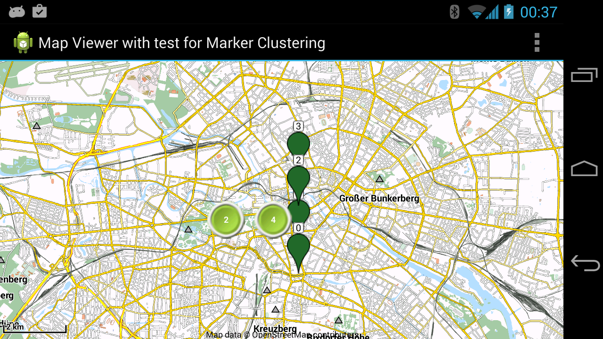
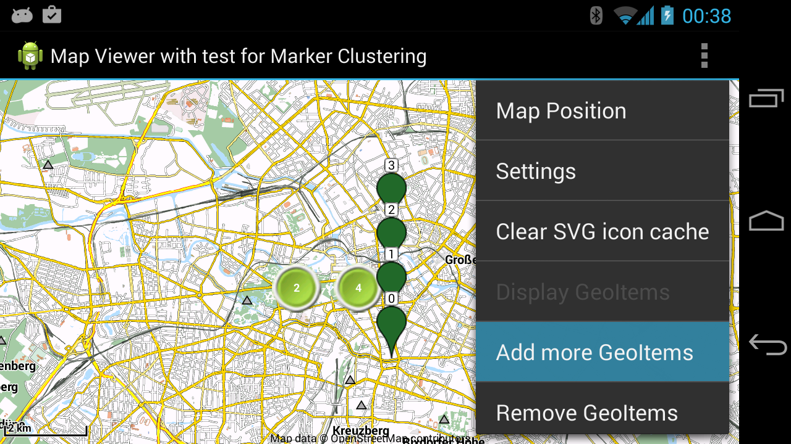
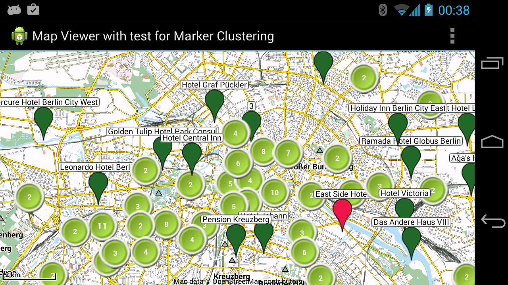

The mapsforge project provides free and open software for the rendering of maps based on OpenStreetMap data. Currently, we offer a library for ad-hoc map rendering on Android devices and in Java stand-alone applications.

**The current stable release is 0.6.0. See the [changelog](docs/Changelog.md) for details, [download official 0.6.0 binaries](docs/Downloads.md).**

- The mapsforge project uses a [compact file format](docs/Specification-Binary-Map-File.md) for fast ad-hoc rendering of OpenStreetMap data.
- We provide tools to [compile your own maps](docs/Getting-Started-Map-Writer.md) with detailed [instructions](docs/MapCreation.md) and also [precompiled maps](http://download.mapsforge.org).
- It provides [simple boilerplate code](docs/Getting-Started-Android-App.md) to [build](docs/Getting-Started-Developers.md) applications for Android that display OpenStreetMap-based maps.
- It provides a library to build standalone applications in Java.
- Mapsforge maps can be flexibly styled with XML style files ([render themes](docs/Rendertheme.md)).
- Mapsforge supports Android 2.3.3 (API level 10) and above. It has been tested on Android 6 Marshmallow.
- Mapsforge is used by many [applications](docs/Mapsforge-Applications.md).
- Mapsforge is in active development: [changelog](docs/Changelog.md), [contributors](docs/Contributors.md). 
- [API documentation](http://mapsforge.org/docs).
- [Official binary releases](docs/Downloads.md). 
- [Latest builds from CI server](http://ci.mapsforge.org/) and [Sonar server](http://sonar.mapsforge.org/).
- Mapsforge is free and open source, licensed under the [LGPL3 license](https://www.gnu.org/copyleft/lesser.html).
- [Mapsforge Talks](docs/Mapsforge-Talks.md).
- [Mailing List](https://groups.google.com/forum/#!forum/mapsforge-dev).

### Screenshots:

