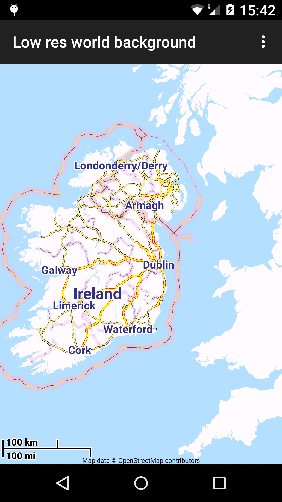

# Map creation (with coastlines)

**For an automated process using Geofabrik see new [mapsforge-creator](https://github.com/mapsforge/mapsforge-creator).**

Processing of coastlines was part of Mapsforge rendering engine, running live on (mobile) devices. Since many versions ago it was removed, so that all coastline processing can take place in advance as part of map creation.

The workaround requires no real changes to the map-writer nor the map-reader, as it just uses the render theme mechanism.



## Land

First of all we need a good set of either land or sea areas. OSM data does not natively have this as coastlines, as opposed to all other data for areas, are just lines. The main OSM renderers all employ some sort of intermediate processing to get the sea and land areas right.

We're using the dataset that Jochen Topf has provided on the [OpenStreetMap Data](https://osmdata.openstreetmap.de/) site, specifically the set: https://osmdata.openstreetmap.de/download/land-polygons-split-4326.zip (the non split version could also work).

We cut the data down a bit, using [ogr2ogr](http://www.gdal.org/ogr2ogr.html) with the bounds for the desired map:

```bash
ogr2ogr -overwrite -progress -skipfailures -clipsrc $LEFT $BOTTOM $RIGHT $TOP land.shp land-polygons-split-4326/land_polygons.shp
```

This produces, depending on the bounds, a much smaller coastline shapefile. We usually extend the boundaries of this file a bit over the actual area for the map, to make sure we don't get any funny cut-offs.

Then we convert the resulting shapefile with [shape2osm.py](https://github.com/mapsforge/mapsforge-creator/blob/master/shape2osm.py) (Python 2.x) and slight modifications (as are always required with shape2osm). We have set:

```python
fixed_tags = {
  'natural': 'nosea',
  'layer': '-5'
}
```

which will attach this tag to all polygons. We also changed the starting id for the OSM ids, as otherwise there is chance of collision with real OSM ids, which will create strange artifacts, like lines running through the map. We also changed the setting for the maximum length of ways, which does not seem to cause a problem.

```bash
python shape2osm.py -l land land.shp
```

We now have `land1.osm`, an OSM XML file with land represented as polygons with the tag "natural" -> "nosea".

## Sea

For the sea we create an osm file with a rectangle having the bounds of the map:

```xml
<?xml version="1.0" encoding="UTF-8"?>
<osm version="0.6">
    <node timestamp="1969-12-31T23:59:59Z" changeset="-1" id="32951459320" version="1" lon="$LEFT" lat="$BOTTOM" />
    <node timestamp="1969-12-31T23:59:59Z" changeset="-1" id="32951459321" version="1" lon="$LEFT" lat="$TOP" />
    <node timestamp="1969-12-31T23:59:59Z" changeset="-1" id="32951459322" version="1" lon="$RIGHT" lat="$TOP" />
    <node timestamp="1969-12-31T23:59:59Z" changeset="-1" id="32951459323" version="1" lon="$RIGHT" lat="$BOTTOM" />
    <way timestamp="1969-12-31T23:59:59Z" changeset="-1" id="32951623372" version="1">
        <nd ref="32951459320" />
        <nd ref="32951459321" />
        <nd ref="32951459322" />
        <nd ref="32951459323" />
        <nd ref="32951459320" />
        <tag k="area" v="yes" />
        <tag k="layer" v="-5" />
        <tag k="natural" v="sea" />
    </way>
</osm>

```

We now have `sea.osm`, an OSM XML file with sea represented as polygons with the tag "natural" -> "sea".

## Merge

The following steps could be taken in one, but we separated them out (a testing legacy).

We merge the resulting osm files of the land polygons and sea rectangle with our real osm data file:

```bash
$OSMOSIS_HOME/bin/osmosis --rb file=data.pbf --rx file=sea.osm --s --m --rx file=land1.osm --s --m --wb file=out.pbf omitmetadata=true
```

## Map writer

out.pbf can now be fed into the map-writer:

```bash
$OSMOSIS_HOME/bin/osmosis --rb file=out.pbf --mw file=out.map bbox=$BOTTOM,$LEFT,$TOP,$RIGHT map-start-position=$LAT,$LON map-start-zoom=$ZOOM
```

The bounding box parameters are now those for the desired map, this will cut off any excess land polygons.

For this to work correctly, only the tag-mapping.xml file needed to be modified by adding:

```xml
<osm-tag key="natural" value="sea" zoom-appear="0" />
<osm-tag key="natural" value="nosea" zoom-appear="0" />
```

This ensures that the new land polygons and sea rectangle areas are included in the resulting file.

Note: The default tag-mapping.xml included in map-writer has already these rules.

This finishes the map creation process.

## Render theme

On the reader side, the only change required is to display the land areas correctly by changing the render theme:

```xml
<?xml version="1.0" encoding="UTF-8"?>
<rendertheme xmlns="http://mapsforge.org/renderTheme" xmlns:xsi="http://www.w3.org/2001/XMLSchema-instance"
    xsi:schemaLocation="http://mapsforge.org/renderTheme .../renderTheme.xsd"
    version="4" map-background="#F8F8F8" map-background-outside="#DDDDDD">

    <rule e="way" k="natural" v="issea|sea">
        <area fill="#B3DDFF"/>
    </rule>

    <rule e="way" k="natural" v="nosea">
        <area fill="#F8F8F8" stroke="#F8F8F8" stroke-width="1.0"/>
    </rule>
```

The first change is to paint the map on a sub white background. Additionally the outside area can be painted on a light grey background.

The 1st rule, at the very top of the file, makes sure all the sea areas get painted first, here in some sort of blue.

The 2nd rule, makes sure all the nosea areas get painted immediately after the sea, here in sub white.

Note: Our provided render themes have already these rules.

With the above procedure complicated coastline areas are all now rendered correctly.

# World map creation

We use land polygons from [OpenStreetMap Data](https://osmdata.openstreetmap.de/), specifically the https://osmdata.openstreetmap.de/download/simplified-land-polygons-complete-3857.zip variant.

The process is completed successfully in some minutes giving the map in our [server](https://download.mapsforge.org/maps/world/).
Alternatively the non simplified variants can be used too.

To convert shp files in osm / pbf format there are many [tools](http://wiki.openstreetmap.org/wiki/Software_comparison/Import_a_shapefile) available.

Then run Osmosis with map-writer:

```bash
$OSMOSIS_HOME/bin/osmosis --rb file=world.pbf --mapfile-writer file=world.map map-start-position=0,0 map-start-zoom=5 zoom-interval-conf=5,0,7
```

We can also add a [TagTransform](http://wiki.openstreetmap.org/wiki/Osmosis/TagTransform) step in the process, if we want to transform the initial land tags to Mapsforge recognizable ones, like `natural=nosea`.

And we can put at the bottom a rectangle with world bounds and `natural=sea`, painting it blue (like described above).
