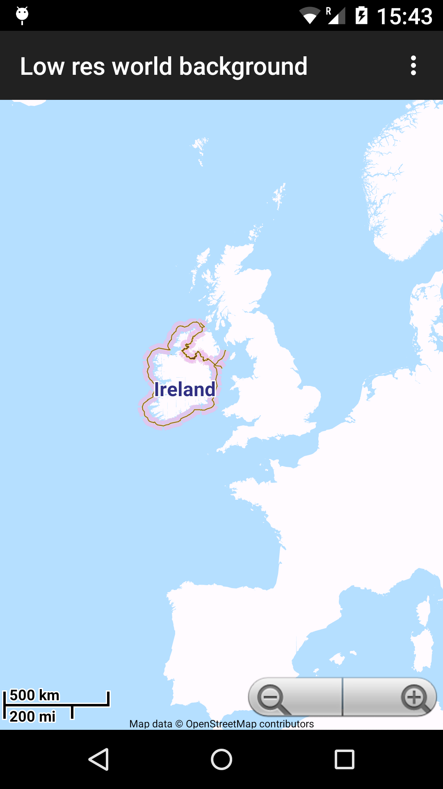

#The MapDataStore Interface

**An introduction to the new MapDataStore interface.**

Mapsforge can use different sources to render map data. The most common is a MapFile, as generated by the Mapsforge [Map Writer](Getting-Started-Map-Writer.md). To widen the source of map data, a new interface has been factored out, the MapDataStore.

###MapDataStore Interface
    public interface MapDataStore {

    /**
     * Returns the area for which data is supplied.
     * @return bounding box of area.
     */
    BoundingBox boundingBox();

    /*
     * Closes the map database.
     */
    void close();

    /**
     * Gets the initial map position.
     * @return the start position, if available.
     */
    LatLong startPosition();
    
    /**
     * Gets the initial zoom level.
     * @return the start zoom level.
     */
    Byte startZoomLevel();

    /**
     * Reads data for tile.
     * @param tile tile for which data is requested.
     * @return map data for the tile.
     */
    MapReadResult readMapData(Tile tile);

    /**
     * Returns true if MapDatabase contains tile.
     * @param tile tile to be rendered.
     * @return true if tile is part of database.
     */
    boolean supportsTile(Tile tile);
    }

###MapFile

Previously known as MapDataBase, the MapFile is the most common incarnation of the MapDataStore interface. It simply wraps a file system map file, to supply the required operations.

###MultiMapDataStore

A MultiMapDataStore allows to combine multiple MapDataStores into one. Previously, something similar was only possible by rendering tiles in different layers, which is quite expensive as each layer takes up memory.

When a tile is rendered with from a MultiMapDataStore, the data from the included MapDataStores is combined and only a single layer is rendered. This implies that the same render theme is being used for all.

To combine the data from the different stores, several policies are supported:

     public enum DataPolicy {
        RETURN_FIRST, 
        RETURN_ALL, 
        DEDUPLICATE 
    }
    
 - RETURN_FIRST will only render data from the first source that has data for a tile. This is useful if the stores are known not to overlap in their coverage or where it is enough to render data from the first store if they overlap.
 - RETURN_ALL will combine the data from all stores. This is the most useful policy if the MultiDataStore is used to combine multiple maps into one.
 - DEDUPLICATE will use data from all stores, but eliminate duplicates. Testing has shown that it is very costly to eliminate duplicates and generally cheaper to render overlapping data twice, so the use of this policy is discouraged.

##An Example

In the Samples app, the MultiMapLowResWorld class shows an example for the use of the MultiMapDataStore to combine a low-res world file that contains only land/sea areas with a more detailed map view for a specific area. 

    multiMapDataStore = new MultiMapDataStore(MultiMapDataStore.DataPolicy.RETURN_ALL);
    multiMapDataStore.addMapDataStore(getMapFile1(), true, true);
    multiMapDataStore.addMapDataStore(getMapFile2(), false, false);
    
The parameters for the addMapDataStore call specify which initial start position and start zoom level should be used for the combined area.

##Advanced Use
 - Since the MultiMapDataStore itself implements the MapDataStore interface, complex maps can be built up that use different DataPolicies. 
 - It is possible to wrap a user supplied data base in this interface, so data supplied by e.g. a Spatialite DB can be directly integrated into the rendering process.

###TODO
Currently, the bounding box for a MultiMapDataStore is the combined bounding box of all individual stores. Maybe this needs some refinement.
